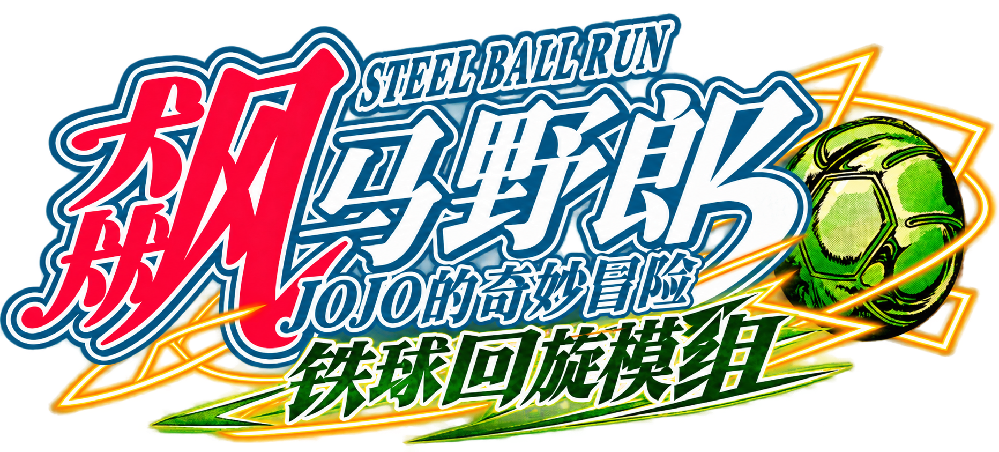

# Steel Ball Spin

**一个受《JOJO的奇妙冒险：Steel Ball Run》启发的 Minecraft Fabric 模组。**  
**A Minecraft Fabric mod inspired by *JoJo's Bizarre Adventure: Steel Ball Run*.**

---

## 中文

### 简介

**Steel Ball Spin** 为 Minecraft 加入了铁球，以及围绕铁球设计的 **四种回旋机制**。

此外，模组中还加入了 **披萨** 作为一个小彩蛋。

### 主要内容

- 铁球
- 四种回旋机制
- 回旋相关的战斗与视觉效果
- 披萨食物彩蛋

## 运行环境

- Minecraft Java 版 `1.21.1`
- Fabric Loader `0.19.3` 或更高版本
- Fabric API
- Java `21` 或更高版本
- 单人游戏：客户端安装模组和 Fabric API
- 多人游戏：服务端与每位客户端都安装相同版本的模组和 Fabric API

## 安装

1. 安装对应版本的 Fabric Loader 和 Fabric API。
2. 将模组 JAR 放入游戏实例的 `mods/` 文件夹。
3. 启动 Minecraft 1.21.1。

---

## English

### About

**Steel Ball Spin** adds Steel Balls to Minecraft together with **four Spin mechanics** built around them.

The mod also includes **Pizza** as a small easter egg.

### Features

- Steel Balls
- Four Spin mechanics
- Spin-related combat and visual effects
- Pizza food for fun XD

## Requirements

- Minecraft Java Edition `1.21.1`
- Fabric Loader `0.19.3` or later
- Fabric API
- Java `21` or later
- Singleplayer: install the mod and Fabric API on the client
- Multiplayer: install the same version of the mod and Fabric API on both the server and every client

## Installation

1. Install the appropriate version of Fabric Loader and Fabric API.
2. Place the mod JAR file into the `mods/` folder of your Minecraft instance.
3. Launch Minecraft 1.21.1.

---

## License / 许可证

The **source code** of this project is licensed under the **GNU General Public License v3.0 (GPL-3.0)**.

The GPL-3.0 license does **not** automatically apply to textures, models, animations, sounds, artwork, logos, or other audiovisual assets included in the project unless explicitly stated otherwise.

Please see [`ASSET_LICENSE.md`](ASSET_LICENSE.md) for details regarding project assets.

本项目的**源代码**采用 **GNU General Public License v3.0（GPL-3.0）**。

除非另有明确说明，GPL-3.0 **不自动适用于**本项目中的贴图、模型、动画、音效、美术、Logo 及其他视听资产。

有关项目资产的详细授权说明，请参阅 [`ASSET_LICENSE.md`](ASSET_LICENSE.md)。

---

## Fan Project Notice / 同人作品声明

This is an **unofficial fan-made project** inspired by *JoJo's Bizarre Adventure: Steel Ball Run*.

*JoJo's Bizarre Adventure*, *Steel Ball Run*, and all related characters, names, designs, concepts, trademarks, and other pre-existing intellectual property belong to their respective rights holders.

No ownership of the underlying *JoJo's Bizarre Adventure* intellectual property is claimed.

This project is not affiliated with, authorized by, sponsored by, or endorsed by Hirohiko Araki, Shueisha, Lucky Land Communications, David Production, or other relevant rights holders.

---

本项目是受《JOJO的奇妙冒险：Steel Ball Run》启发制作的**非官方同人 Minecraft 模组**。

《JOJO的奇妙冒险》《Steel Ball Run》及其相关角色、名称、设计、概念、商标和其他既有知识产权均归相应权利人所有。

本项目不主张拥有《JOJO的奇妙冒险》原作相关知识产权。

本项目与荒木飞吕彦、集英社、Lucky Land Communications、David Production 及其他相关权利人不存在官方关联、授权、赞助或认可关系。
